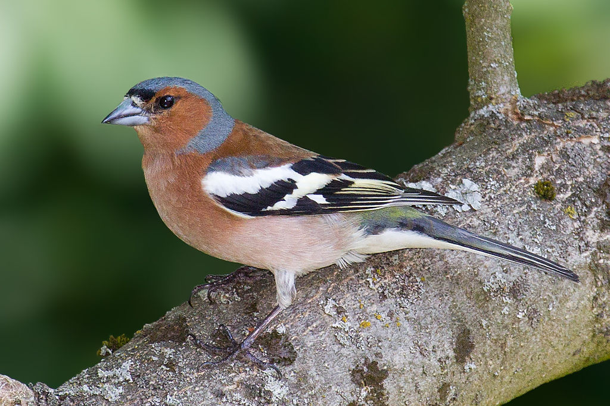
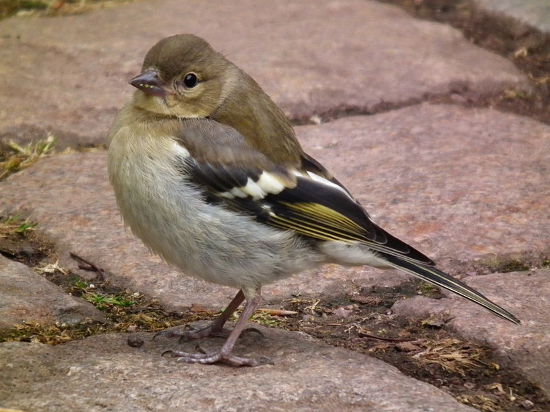

# Introduction 

<!-- This setup chunk needs to go first to set a few basic rules to be followed by the rest of the rmarkdown doco, including echo = FALSE -->

```{r setup, include=FALSE}
knitr::opts_chunk$set(echo = FALSE)
```

This is first paper that I found when I looked on Google Scholar for papers about chaffinches [@lachlan2003song]. I then chose this paper by Brumm & Mattias [-@brumm2011song] which was another paper from Google Scholar about singing and chaffinches. 

The male and female birds look very different to each other. The male chaffinch is much more colourful and bright as shown in Figure \@ref(fig:male-chaff-fig). Figure \@ref(fig:female-chaff-fig) the duller, less colourful female chaffinch. 

(ref:male-chaff-fig) This is a nice colourful male chaffinch. By Photo © Wikipedia, https://en.wikipedia.org/wiki/Common_chaffinch#/media/File:Chaffinch_(#Fringilla_coeleb).jpg

```{r male-chaff-fig, out.height="200px", fig.cap='(ref:male-chaff-fig)'}

```

(ref:female-chaff-fig) This is a lovely less colourful female chaffinch. By Photo © Wikipedia,  https://en.wikipedia.org/wiki/Common_chaffinch#/media/File:Fulda_Buchfinkweibchen_Juni_2012.JPG

```{r female-chaff-fig, out.height="200px", fig.cap='(ref:female-chaff-fig)'}

```

# Methods


We used R [@team2013r] with tidyverse packages [@R-tidyverse] for all analyses and the rmarkdown [@markdown1] and bookdown [@bookdown] packages for manuscript preparation.

<!-- keep this default set up code chunk -->


```{r read in data, include=FALSE}
chaff <- read.table("data-raw/chaff.txt", header = T)
```


```{r setup2, include=FALSE}
knitr::opts_chunk$set(echo = FALSE, 
                      warning = FALSE,
                      message = FALSE,
                      fig.retina = 3)
```

<!-- update the tidyverse package -->
```{r packages}
library('tidyverse')
chaff_tidy <- chaff %>%
  pivot_longer(names_to = "sex",
               values_to = "mass",
               cols = everything())
```

<!-- adding a code chunk to calculate SS(x) of all the mass values -->
```{r sum_sq(chaff_mass)}
sum_sq <- function(chaff_tidy) {
  sum((chaff_tidy - mean(chaff_tidy))^2)
}

```

<!-- two variables defined within the function 
created a dataframe with the column measure in it
measure is a generic -->
```{r column function}
sum_sq <- function(df, measure) {
  df %>% summarise(ss = sum(({{measure}} - mean({{measure}}))^2))
}
sum_sq(chaff_tidy, mass)

# adapt the function to calculate the SS(x) for each sex
# here measure and group are standard and then you can plug in the specific variables
sum_sq <- function(df, measure, group) {
  df %>% group_by({{ group }}) %>% 
    summarise(ss = sum(({{measure}} - mean({{measure}}))^2))
}

sum_sq(chaff_tidy, mass, sex)
```

<!-- here we are calculating the summary data - mean/ sd/ se etc 
creates a new table with the results in
this is not using a function though! this is pipeline-->


```{r summary data}
chaff_summary <- chaff_tidy %>% 
  group_by(sex) %>% 
  summarise(n = length(mass),
            mean = mean(mass),
            sd = sd(mass),
            se = sd/sqrt(n))
```
<!-- If you want to include some values from some stats in your text make sure the text chunk comes AFTER the code chunk so that it can actually be used in the text!! -->

We measured the mass of `r sum(chaff_summary$n)` individuals in total, equal numbers of both males and females.

<!-- creating a function which will calculate the summary stats for the data 
remember to add ALL the types of brackets () and {} -->
```{r data_summary}
data_summary <- function(df, measure, group) {
  df %>% group_by({{ group }}) %>% 
    summarise(mean = mean(({{measure}})),
              sd = sd(({{measure}})),
              n = n(({{measure}})),
              se = se(({{measure}})))
}
```

# Results 

```{r summary-table}
# this code chunk is to create the summary table
chaff_summary %>% 
  knitr::kable(caption = "Summary statistics for Chaffinches",
               digits = 2,
               col.names = c("Sex", 
                             "Mean", 
                             "N",
                             "Stdev",
                             "Stder"))
```

<!-- paired t test to see the difference between the mass of the males and females -->
```{r data analysis, include=FALSE} 
res <- t.test(data = chaff_tidy, 
       mass ~ sex,
       var.equal = T)
```

There was a significant difference between the mean masses of the female and male chaffinches. This is demonstrated by the results of the t test where the p value was `r res$p.value` and the difference is also displayed in Figure \@ref(fig:mass-fig).
<!-- to be able to input the p.value firstly give the t test results a name then you can do str(res) of this object and then select the name of the value that you would like to include within the text-->

(ref:mass-fig) Boxplot comparing the mean mass for male and female chaffinches.

```{r mass-fig, fig.cap="(ref:mass-fig)"}
ggplot(chaff_tidy, aes(x = sex, y = mass)) +
  geom_boxplot()
```


# Discussion

# References

